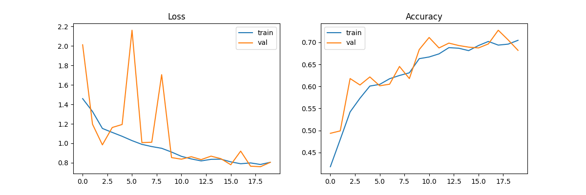

# 花卉分类任务报告

## 一、模型信息

### 1. 模型名称
- **ResNet-50**（可通过参数选择为 ResNet-18、ResNet-34、ResNet-101）

### 2. 网络结构与修改
- 基础结构来源于 `torchvision.models` 中的预训练 ResNet 系列。
- 修改部分：将最后的全连接层 `model.fc` 替换为 `nn.Linear(num_ftrs, num_classes)`，使其适应当前任务的花卉分类类别数量。
- 优化器：Adam
- 损失函数：CrossEntropyLoss
- 学习率调整策略：`ReduceLROnPlateau`，监控验证集 loss，patience=5，factor=0.1。

---

## 二、数据集处理

- 数据来源：`./flower_data`
- 数据划分：
  - 训练集：`./flower_data/train`
  - 验证集：`./flower_data/val`
- 预处理策略：
  - **训练集增强**：随机裁剪、旋转、颜色抖动、水平翻转等；
  - **验证集增强**：固定大小中心裁剪，标准化处理。

---

## 三、训练参数

- **设备**：自动检测（优先使用 GPU）
- **批量大小**：`--batch_size 32`
- **训练轮数**：`--epochs 20`
- **学习率**：`--lr 0.001`
- **模型输出路径**：`--output_dir ./outputs`
- **类别数**：根据训练集自动识别

---

## 四、训练与验证过程可视化

> 模型训练过程中，损失与准确率变化如下图所示：

---

## 五、测试结果与分析

- 模型在训练过程中自动保存验证集上最佳精度对应的模型为：`./outputs/best_model_resnet50.pth`

### 1.测试配置信息

- **使用设备**: `cuda:0`
- **模型类型**: `resnet50`
- **训练时的类别数量**: `5`
- **测试集中的类别数量**: `5`
- **加载模型路径**: `./outputs/best_model_resnet50.pth`
- **测试数据目录**: `./flower_data/test`

### 2. 测试集测试结果
- 模型在测试过程中结果如下图所示，全部预测正确。

